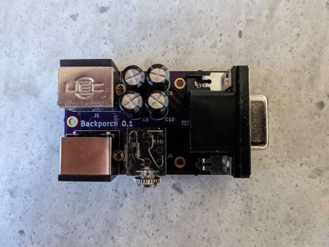

# Backporch

Backporch is a board to connect many classic gaming consoles with widely
available and easily made cables with no components inside.  Backporch can then
be connected to PVMs (via HD15), Extron matrices, SCART TVs or
[OSSC](http://junkerhq.net/xrgb/index.php?title=OSSC) / [RetroTINK](https://www.retrotink.com/)
devices.

PVMs and Extron matrices can be connected with a simple VGA to BNC or VGA to
VGA cable. SCART TVs can be connected with a component-free Mini-DIN 8 to SCART
cable.

It is also possible to use Backporch to adapt any SCART cable into a TTL sync
output suitable for PVMs.

Backporch includes the necessary resistors, coupling caps and a sync stripper /
sync booster ([Renesas
EL1883](https://www.renesas.com/us/en/products/analog-products/audio-video/video-ics/video-sync-separators/el1883-sync-separator-horizontal-output)
or [Renesas
ISL59885](https://www.renesas.com/us/en/products/analog-products/audio-video/video-ics/video-sync-separators/isl59885-auto-adjusting-sync-separator-hd-and-sd-video))
for an excellent sync signal. Schematics [here](generated/schematics.pdf).

## Inputs

There are two inputs:

* The (mini) DIN 9 connector is suitable for consoles that output directly from
  a video amplifier to the back of the console.  Cables for such consoles
typically have impedence matching resistors as well as coupling capacitors.

* The (mini) DIN 8 connector (also usable as output) can be used to turn any
  existing SCART setup into a TTL sync setup suitable for PVMs. All one needs
is a simple passive SCART to (mini) DIN 8 cable such as the ones compatible
with the Framemeister XRGB mini.

It also can be used directly as input with a staight DIN 8 cable for consoles
that have retro mods, such as the NES RGB mod or some superguns.

## Outputs

There are two video outputs:

* The DE-15/HD-15 ("VGA") connector is suitable for PVMs (or the DE-15 input on
  the OSSC) and is best used with widely available HD15 to BNC cables. It will
output composite sync or separate H-SYNC and V-SYNC depending on the JP3
jumper.

* The (mini) DIN 8 connector (also usable as input) is suitable for SCART
  output using a widely available mini DIN 8 to SCART cable. This output can
also be used to connect directly to a Framemeister XRGB mini with a simple mini
DIN 8 cable.

Jumpers:

* JP1: Solder pad 1 (arrow) and 2 together (keep the 2-3 connection open)
* JP2: keep open for normal operation. If you never want to use the Mini DIN 8
  as an output, or if you're having sync issues, short it.
* JP3: Solder pad 2 and 3 together for an RGBS output with composite sync
  (CSYNC), or pad 1 (arrow) and 2 instead for a RGBHV output with separate
HSYNC and VSYNC.

## Supported consoles

### NES (Famicom) RGB mod

* If your mod uses the mini DIN 8 output, simply use a mini DIN 8 to mini DIN 8
  cable
* If your mod uses the multi-av output, solder a simple passive cable from the
  multi AV to mini DIN 8

### Sega Mega-Drive / Genesis 2

* Use a simple mini DIN 9 to mini DIN 9 cable.

Sega 32X cables work well, but all pins need to be connected. Some
high quality, proper 32X cables don't have PIN 2 (5V) connected. Most "cheap"
cables on Ebay have all pins connected. Some bad cables don't have ground
connected.

(You can use cables without PIN 2 if you don't solder U1 and change JP1)

### Sega Mega-Drive / Genesis 1

* There are many model 1 to model 2 adapters available

### Super Nintendo / Super Famicom

* If your Super Nintendo is modded with an RGB bypass mod, you can build a
  simple cable from MultiAV to mini-din 8.  Wire sync (Pin 3) from either
composite or Luma (better!). This will work for either PAL or NTSC consoles! If
you have CSYNC wired, you can use that instead, but ideally configure your RGB
bypass board to output 75 Ohm CSYNC.

* Unmodded Super Nintendo are not supported at this time as they require
  coupling capacitors (things will work without them, but this setup might draw
excessive current from the video amplifiers).

Of course, if you already have a SCART cable for your Super Nintendo, you can
still use Backporch to [restore TTL sync and plug it to a PVM](#anything-else).

### PC Engine/ TurboGrafx-16

Either with Terraonion's SSDS3, Insurrection Industries' Spark Plug or the db
GrafxBooster TTP:

* Same as [Sega Mega-Drive / Genesis 2](#sega-mega-drive--genesis-2).

### Neo Geo AES

* Build a simple passive cable from the Neo Geo DIN8 to standard Mini DIN 8

### Neo Geo MVS

* If you use the [Minigun
  Supergun](https://www.arcade-projects.com/threads/minigun-supergun-an-open-source-supergun.9408/)
or the [HAS](https://homearcadesystem.wordpress.com/about/), you can simply use
a Mini DIN8 to Mini DIN8 cable between the Supergun and Backporch.

### Anything else

If you already have a SCART cable for your device and all you need is a sync
stripper / booster to connect to a PVM or an Extron matrix, you can use any
SCART to mini DIN 8 cable, such as the ones used for the Framemeister XRGB
mini.

## Getting good cables

Ideally, proper analog video transmission should happens over 75 Ohm coaxial
cables.  [Proper impedence
matching](https://en.wikipedia.org/wiki/Impedance_matching#Transmission_lines)
requires a 75 Ohm resistor at the source and a 75 Ohm resistor at the
destination. This is why many retro-gaming cables that have resistors meant for
the source inside the SCART (near the destination) are not proper. At the
frequencies used in classic gaming console signals, this only really matters
for very long cables though.

You should strive to use high quality shielded cables to Backporch and keep
them short. If only one of those properties holds true, you should still be
fine. Properly shielded 75 Ohm cables used from Backporch's outputs can be
long.

Use [this issue](https://github.com/semi-simple/backporch/issues/1) for a
discussion of where to source good cables.

## Ordering the board

You can order the board directly from Oshpark
[here](https://oshpark.com/shared_projects/adF28fFL) or download the Gerber
files from them and send those to your favorite manufacturer.

You can order the needed components by using this
[BOM file](generated/backporch_bom.csv). If you order from Digi-Key, you can
simply upload this file to them.

## FAQ

* What does the name mean?

It's a small deck at the back of your console (back porch). It's also a
reference to the blanking interval after the sync pulse in video signals.

* Do I need all those components?

Maybe not. For many inputs, if you know what you're doing, you can remove
all components related to sync stripping and use JP1 to send sync directly to
HSYNC on the DE-15 port. For THS737X mods ("RGB bypass"), coupling capacitors
are not needed. Remove the big electrolytic capacitors and bridge the footprint
of the small ones.

* There is "noise" when connecting to an OSSC via DE-15. What gives?

The DE-15 input (AV3) on the OSSC does not have a proper low-pass filter. You can
use the SCART input instead, or you can route the RGB lines to AV2 instead (via
BNC/RCA adaptors and VGA/BNC breakout cables) and use the "AV3 use alt. RGB"
option on the OSSC.

* I like the Renesas ISL59885 chip better. Could I use it instead?

You're in luck: it works as a drop-in replacement for U1. Just keep R2
unpopulated and replace C2 with a 56nF X7R grade capacitor.
